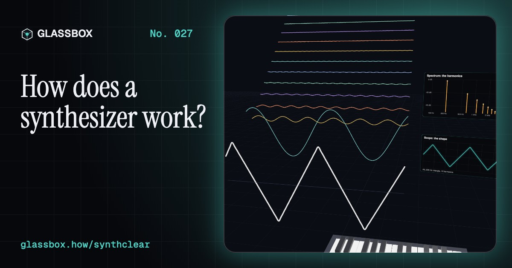
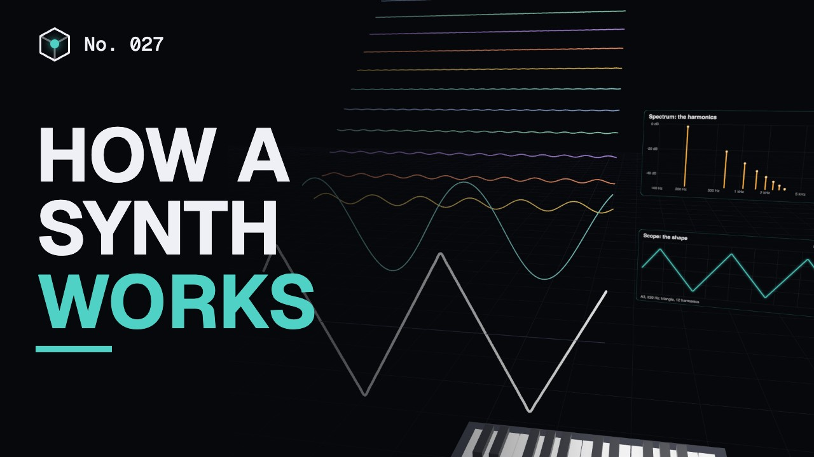
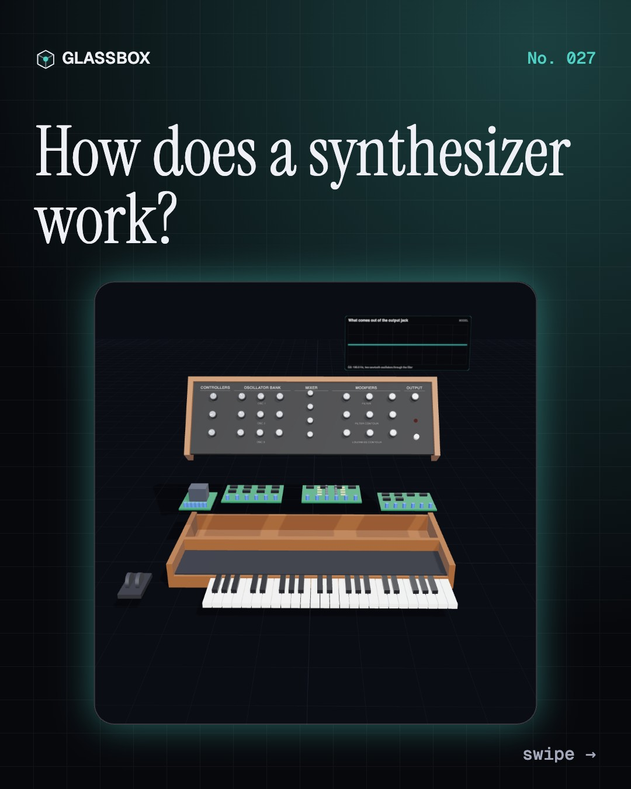
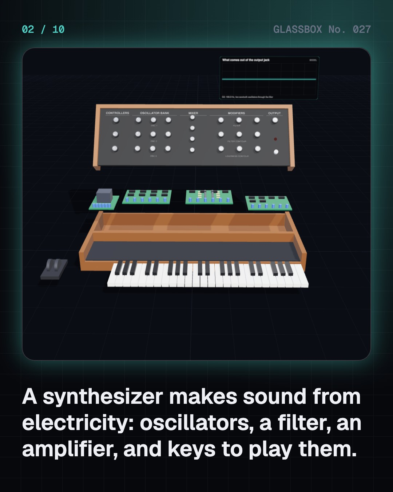
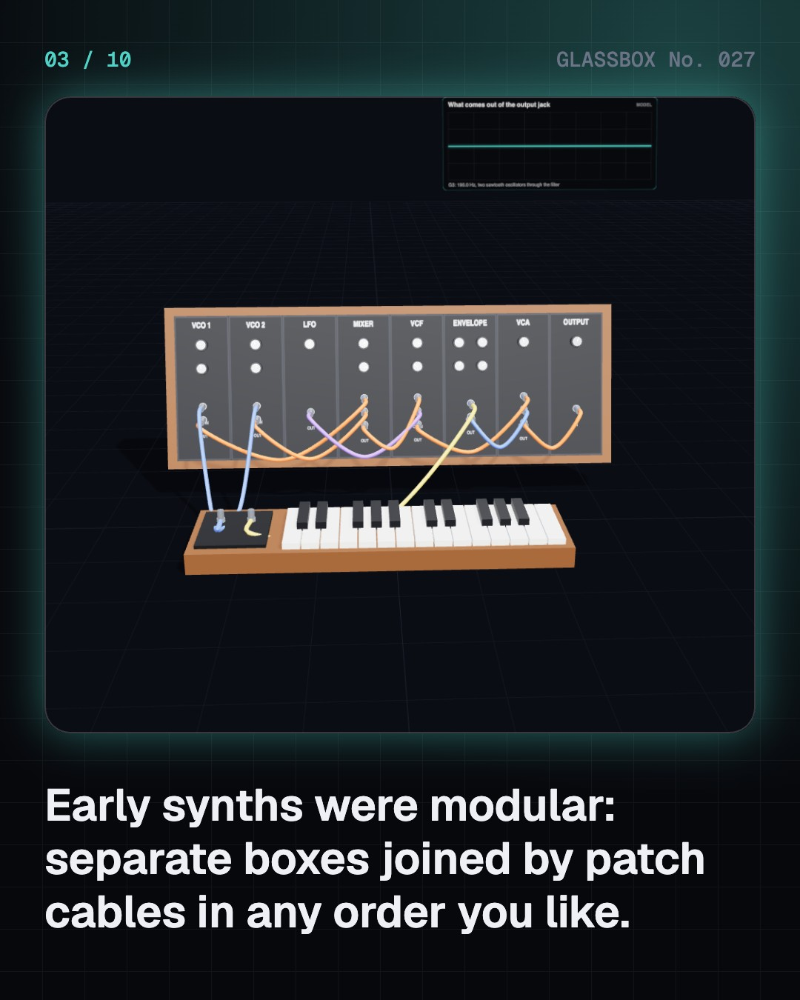
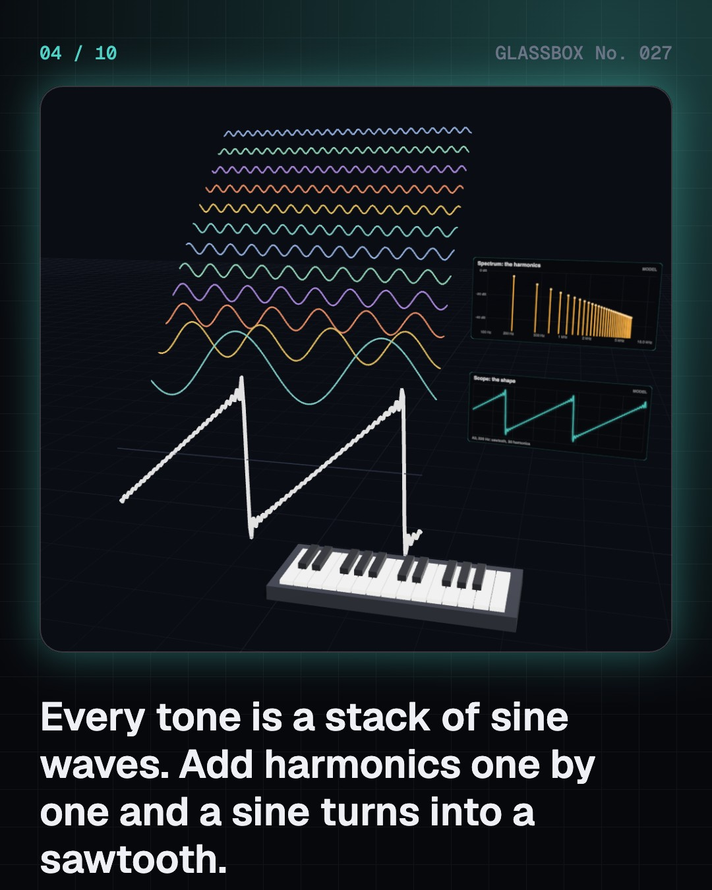

<!-- glassbox:start -->
<!-- Generated from glassbox.json by the Glassbox hub (npm run readme -- synthclear). Edit glassbox.json, not this block. -->
<p align="center"><a href="https://glassbox.how/e/synthclear/"></a></p>

<h1 align="center">SynthClear</h1>

<p align="center"><b>How does a synthesizer work?</b><br>A synthesizer builds sound from nothing but electricity: oscillators hum, a filter carves, an envelope shapes every note. Play a real synth in your browser, take a Minimoog-style keyboard apart in 3D, and see why two sine waves can ring like a bell.</p>

<p align="center"><a href="https://glassbox.how/synthclear/"><b>▶ Play with it</b></a> &nbsp;·&nbsp; <a href="https://glassbox.how/e/synthclear/">Read the 60-second explainer</a> &nbsp;·&nbsp; <a href="https://glassbox.how/synthclear/glassbox/reel.mp4">Watch the 40-second video</a></p>

<p align="center">
  <a href="https://glassbox.how/e/synthclear/"></a>
  <a href="https://glassbox.how/e/synthclear/"></a>
  <a href="LICENSE"></a>
  <a href="LICENSE-CONTENT.md"></a>
  <a href="#privacy"></a>
</p>

## In 60 seconds

1. **Oscillators, a filter, an amplifier.** A classic synth has three main parts in a row. Oscillators make a buzzing wave, a filter shapes its tone, and an amplifier sets how loud it is. The keyboard only sends two signals: which note, and when a key is down.
2. **Every tone is a stack of sine waves.** Any repeating wave is a sum of sine waves at 1, 2, 3… times its frequency: its harmonics. A sawtooth has every harmonic at 1/n, a square only the odd ones at 1/n, and a triangle the odd ones at 1/n², which is why it sounds so soft.
3. **Subtractive: start bright, carve away.** A lowpass filter lets low frequencies through and cuts the high harmonics. Moog's ladder filter falls 24 dB per octave. Resonance boosts the harmonics right at the cutoff, and sweeping the cutoff makes the classic wah.
4. **Attack, decay, sustain, release.** An envelope gives each note a shape in time. Attack is the rise, decay the fall to the sustain level, which holds while the key is down, and release the fade after you let go. Short and sharp is a pluck; slow and long is a pad.
5. **FM: one wave wobbles another.** John Chowning found at Stanford that wobbling a sine wave's frequency very fast adds sidebands at the carrier plus and minus multiples of the modulator. The ratio places them and the index sets how many. Yamaha's DX7 made it famous in 1983.
6. **MIDI: messages, not sound.** Since 1983, instruments talk in MIDI: three bytes such as note on, which note, and how hard, sent at 31,250 bits a second. A step sequencer sends them on time, the idea behind drum machines like the Roland TR-808 and every DAW today.

## Words worth knowing

| Term | Meaning |
|---|---|
| **Oscillator** | A circuit or program that makes a repeating wave. Its frequency sets the note. |
| **Harmonic** | A sine wave at a whole-number multiple of a note's frequency. The mix of harmonics sets the tone. |
| **Subtractive synthesis** | Making a sound by starting with a bright wave and filtering harmonics away. |
| **Lowpass filter** | A filter that passes low frequencies and cuts high ones, above its cutoff. |
| **Resonance** | A boost at a filter's cutoff, made by feeding its output back in. |
| **ADSR envelope** | Attack, decay, sustain and release: the four settings that shape a note in time. |
| **LFO** | Low-frequency oscillator: a slow wave that wobbles pitch, tone or loudness. |
| **FM synthesis** | Making rich sounds by wobbling one sine wave's frequency with another at audio speed. |
| **MIDI** | The 1983 standard that lets instruments and computers send notes to each other as short messages. |

## A short history

**130 years from a 200-ton music machine in New York to synthesizers that live inside a laptop.**

- **1906** · A 200-ton music machine (Thaddeus Cahill, Holyoke, Massachusetts and New York City, USA)
- **1920** · An instrument you never touch (Leon Theremin (Lev Termen), Petrograd (today St Petersburg), Russia)
- **1964** · Moog's modules take the stage (Robert Moog, with composer Herb Deutsch, Trumansburg and New York City, USA)
- **1968** · Switched-On Bach (Wendy Carlos, with producer Rachel Elkind, New York City, USA)
- **1979** · The Fairlight and the birth of sampling (Peter Vogel and Kim Ryrie (Fairlight), Sydney, Australia)
- **1980** · The TR-808 drum machine (Roland (Ikutaro Kakehashi, Tadao Kikumoto), Japan)
- **1982** · Ten Ragas to a Disco Beat (Charanjit Singh, Bombay (today Mumbai), India)
- **1983** · MIDI: one language for all instruments (Dave Smith (Sequential Circuits) and Ikutaro Kakehashi (Roland), NAMM show, Anaheim, California, USA)

The full story, with 30 moments, charts, people and 61 sources: [glassbox.how/e/synthclear/history](https://glassbox.how/e/synthclear/history/). The data lives in [`history.json`](history.json).

## Video and slides

Made with the Glassbox studio from this box's storyboard (`window.glassbox.director`). Free to reuse under CC BY 4.0.

<a href="https://glassbox.how/synthclear/glassbox/video.mp4"></a>

<p><a href="glassbox/slide-1.jpg"></a> <a href="glassbox/slide-2.jpg"></a> <a href="glassbox/slide-3.jpg"></a> <a href="glassbox/slide-4.jpg"></a></p>

| File | What | Size |
|---|---|---|
| [`glassbox/reel.mp4`](https://glassbox.how/synthclear/glassbox/reel.mp4) | Reel / Short, with captions and soundtrack | 1080×1920 |
| [`glassbox/video.mp4`](https://glassbox.how/synthclear/glassbox/video.mp4) | YouTube video, with captions and soundtrack | 1920×1080 |
| `glassbox/slide-1…10.jpg` | Instagram carousel | 1080×1350 |
| `glassbox/thumb.jpg` | YouTube thumbnail | 1280×720 |
| `glassbox/cover.jpg` | Share card and repo social preview | 1200×630 |
| [`glassbox/history-reel.mp4`](https://glassbox.how/synthclear/glassbox/history-reel.mp4) | “History in 10 moments” Reel / Short | 1080×1920 |
| `glassbox/history-slide-*.jpg` | History carousel | 1080×1350 |
| `glassbox/post.json` | Post copy and schedule used by the publish kit | |

## Privacy

This box has no accounts and no ads, and it ships its own fonts and libraries. When you run it yourself it sends nothing anywhere. On glassbox.how, the site's `/bar.js` also loads Glassbox's analytics: **Google Analytics** to count visits (it asks first in the EU, UK and Switzerland, and stays off when your browser sends Global Privacy Control or Do Not Track) and **ClickTrust** to detect bots.

It remembers a few things **in your own browser only**, and never sends them anywhere:

| Browser storage key | What it holds |
|---|---|
| `synthclear.v1` | Which chapters you have opened, your best quiz scores, and sound on or off. |

Exactly what each one sees is at [glassbox.how/privacy](https://glassbox.how/privacy/).

## Licences

- **Code:** [MIT](LICENSE). Use it, change it, ship it.
- **Explanations, text, images and videos** (`glassbox.json`, `glassbox/`): [CC BY 4.0](LICENSE-CONTENT.md). Credit “Glassbox, glassbox.how/e/synthclear”.
- **Third-party parts** keep their own licences: [three.js](https://threejs.org) (MIT), [Geist, Instrument Serif](https://openfontlicense.org) (SIL OFL 1.1).
- The Glassbox name and logo aren't covered by either licence. See the [terms](https://glassbox.how/terms/).

Found a mistake? [Open an issue](https://github.com/bdeeps/synthclear/issues). Corrections happen in public.
<!-- glassbox:end -->

## Run it

It's plain HTML, CSS and JavaScript. No build step and no dependencies. Run locally, it contacts no other website.

```bash
python3 -m http.server 8000
```

Three.js and the fonts ship in `vendor/` and `fonts/`, so it also works offline.

Then open http://localhost:8000.

## How it's built

| File | What |
|---|---|
| `index.html`, `css/app.css` | The page and its styles |
| `js/app.js`, `js/stage.js`, `js/ui.js`, `js/kit.js` | The shared Glassbox 3D engine: chapters, 3D stage, controls, quiz, video director |
| `js/chapters/*.js` | One file per chapter: the 3D model, controls, text, key terms, quiz and video scenes |
| `js/synth.js` | The WebAudio synth (oscillators, 24 dB lowpass, ADSR, LFO, 2-operator FM, TR-808-style drums, 16-step sequencer and arpeggiator), the filter, envelope and Bessel maths, the playable 3D keyboard, and the scope and spectrum boards |
| `glassbox.json` | Title, question, explainer beats, key terms, browser storage and credits shown on glassbox.how |
| `reel` in each chapter | The storyboard the Glassbox studio records into short videos |
| `glassbox/` | The published video, slides, thumbnail and post copy |
| `fonts/`, `vendor/three/` | Self-hosted Geist and Instrument Serif (SIL OFL 1.1) and three.js (MIT) |
